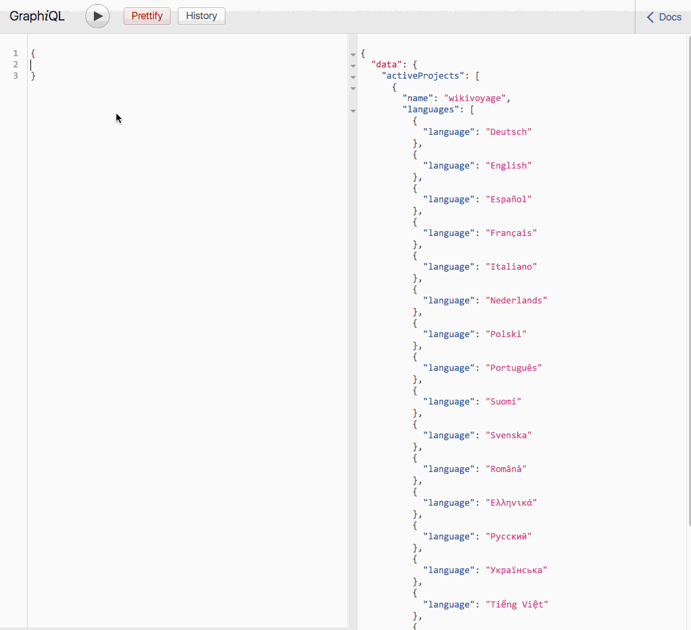

# wikimedia-graphql

A test implementation of a graphql server for Wikimedia APIs. WIP.

## Links

* http://graphql.org/learn/schema/
* https://github.com/apollographql/apollo-server
* http://dev.apollodata.com/tools/graphql-tools/generate-schema.html
* https://github.com/apollographql/GitHunt-API/blob/master/api/schema.js
